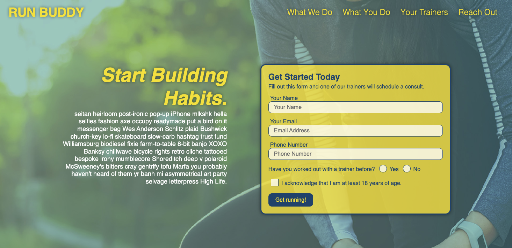

# RUN BUDDY

## Table of Content
 
 * [Description](#description)
 * [Visuals](#visuals)
 * [Deploy](#deploy)
 * [Github](#github)
 * [Technologies](#technologies)
 * [Support](#support)
 * [Author](#author)

## Description

Landing Page for Run Buddy to attract more sign-ups.
Run Buddy is a company tach matches runners with personal trainers.

## Visuals

## Deploy
https://thiago-nasciutti.github.io/run-buddy-landing-page/

## Github
https://github.com/thiago-nasciutti/run-buddy-landing-page

## Technologies
     

## Support
nasciutti.thiago@gmail.com

## Author
Thiago Borges Nasciutti

